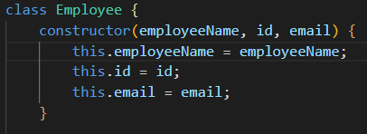
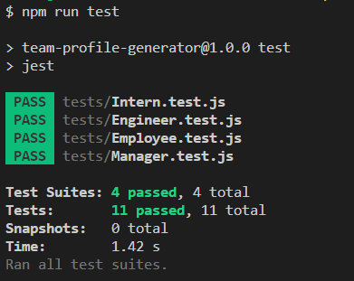

# team-profile-generator

Team profile generator is a project which allows a manager to enter basic employee information through a commnad line prompt, store that information in a mock database, and easily access it as an HTML page for reference.

## Install

To run this project locally, first, fork and clone the repo.  Then run "npm i" from the command line to install the necessary dependencies.

## Object Oriented Programming

Team profile generator was built on the premise of OOP.  Utilizing Javascript classes and subclasses to encapsulate our data.  Class employee is our default class storing basic information related to any employee.  Subclasses of Manager, Engineer, and Intern extend the Employee class, and possess unique data of their own.  Using npm Inquirer, user prompts from the command line allow users to select and enter information for a Manager, Engineer, and Intern respectively.

## Test Driven Development

Team profile generator was built using TDD also.  Utilizing the Jest testing package, unit tests were written for each class/subclass prior to any coding.  This was a new experience for me, having to write a test for something that hasn't otherwise been coded yet.  To run the tests, from the command line, enter "npm run test"

### Dependencies:

* Inquirer

### Dev Dependencies:

* Jest

## Conclusions

Object oriented programming is a new concept to, as well as test driven development.  The potential of these two programming concepts is clear to me, they will however require additional practice to be able to exercise that potential.  This mock up project created a simple opportunity to see these larger concepts in action.

## Check it out

[My GitHub portfolio.](https://github.com/ObviousEcho/team-profile-generator)